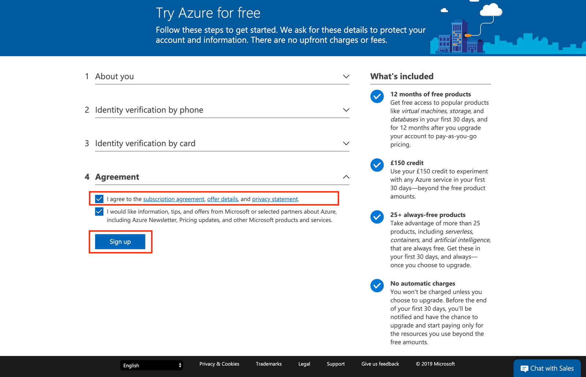
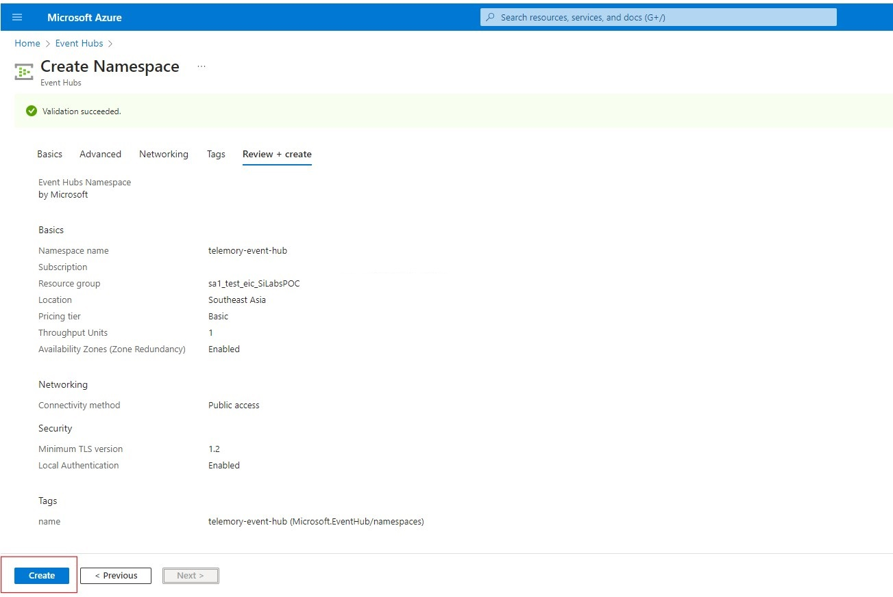
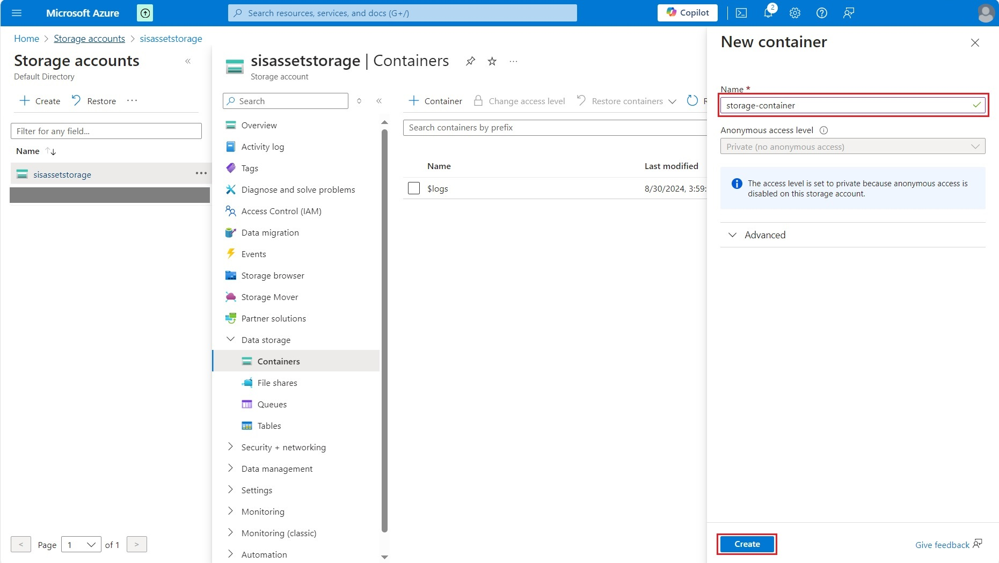

# Wi-Fi - Asset Tracking - Azure Cloud Configuration

## Table of Contents

- [Overview](https://github.com/SiliconLabs/wifi_applications/blob/main/wifi_asset_tracking/AZURE.md#overview)
- [Getting Started](https://github.com/SiliconLabs/wifi_applications/blob/main/wifi_asset_tracking/AZURE.md#getting-started)
  - [Azure Account Creation](https://github.com/SiliconLabs/wifi_applications/blob/main/wifi_asset_tracking/AZURE.md#azure-account-creation)
  - [Create Event Hubs](https://github.com/SiliconLabs/wifi_applications/blob/main/wifi_asset_tracking/AZURE.md#create-event-hubs)
  - [Azure Storage Account Setup](https://github.com/SiliconLabs/wifi_applications/blob/main/wifi_asset_tracking/AZURE.md#azure-storage-account-setup)
  - [To get STORAGE\_CONNECTION\_STRING](https://github.com/SiliconLabs/wifi_applications/blob/main/wifi_asset_tracking/AZURE.md#to-get-storage_connection_string)
  - [To get CONTAINER\_NAME](https://github.com/SiliconLabs/wifi_applications/blob/main/wifi_asset_tracking/AZURE.md#to-get-container_name)
  - [Azure IoT Hub Setup](https://github.com/SiliconLabs/wifi_applications/blob/main/wifi_asset_tracking/AZURE.md#azure-iot-hub-setup)
    - [Register IoT Device with symmetric key authentication](https://github.com/SiliconLabs/wifi_applications/blob/main/wifi_asset_tracking/AZURE.md#register-iot-device-with-symmetric-key-authentication)
    - [Register IoT Device with X509 authentication](https://github.com/SiliconLabs/wifi_applications/blob/main/wifi_asset_tracking/AZURE.md#register-iot-device-with-x509-authentication)
    - [Configure Message routing in IoT Hub](https://github.com/SiliconLabs/wifi_applications/blob/main/wifi_asset_tracking/AZURE.md#configure-message-routing-in-iot-hub)
    - [Get deviceId](https://github.com/SiliconLabs/wifi_applications/blob/main/wifi_asset_tracking/AZURE.md#get-deviceid)
    - [Azure App Registration](https://github.com/SiliconLabs/wifi_applications/blob/main/wifi_asset_tracking/AZURE.md#azure-app-registration)

## Overview

End users have to follow below steps to run

- Azure Account Creation
- Azure Event Hub Creation
- Azure Storage Account Setup
- Azure IoT Hub Setup
- Azure App Registration

## Getting Started

### Azure Account Creation

Azure offers a free 30-day trial account for all new account holders, later depending on the services you will be charged in [Pay-as-you-go way.](https://azure.microsoft.com/en-in/pricing/)

- You can follow the below steps or refer on [how to create an Azure Account](https://docs.microsoft.com/en-us/learn/modules/create-an-azure-account/)

  1. Navigate to <https://azure.microsoft.com/>

  2. Click on “Free Account” in the top right

     

  3. Confirm that you wish to "Start for free"

     

  4. Enter the details requested to register for Microsoft Azure account. (Details like email, username, password, etc...)

  5. Finally, agree to the Microsoft Azure terms and conditions to complete the setup process

     

  6. At this stage you should be getting an Azure link to your Azure Account

You have now successfully created Azure account and you will be able to access all Azure Services.

### Create Event Hubs

1. Search Event Hubs and Go to the Event Hubs.

    

2. Create new Event Hubs by clicking on the Create button

    

3. Follow these steps as mentioned in the below images

    

    

    

    

    

4. After creating the Event Hubs, it will appear in the listing

    

5. Click on the newly created Event Hubs for creating new Event Hubs Namespace.

    

6. Click on the Event Hubs and click on create new.

    

- Choose an Event Hub name and create it.

  

- Review all the information and click on create.

  

- After creating it will appear on the listing.

  

- Click on newly created Event Hub name.

  

- Go to the shared access policy and create a new listen policy by clicking on the Add button. Choose a name for this policy and then create it.

  

- After creating the listen policy, it will appear in the listing. Click on it, copy the connection string–primary key, and update the IOT_EVENT_HUB_ENDPOINT variable value in .env file inside the backend folder

  

**Note:** Follow this link for creating backend .env file [Create .env file](https://github.com/SiliconLabs/wifi_applications/blob/main/wifi_asset_tracking/dashboard/README.md#create-env-file-for-backend)

- Reference Link - [Referece](https://learn.microsoft.com/en-us/azure/event-hubs/event-hubs-create#create-an-event-hub)

### Azure Storage Account Setup

### To get STORAGE_CONNECTION_STRING

1. Go to the storage account.

    

2. Create a new storage account.

    

3. Choose a storage account name and click on create.

    

4. Review your details and click on create.

    

5. Click on the newly created storage account.

    

6. Click on Access key and copy the connection string.

    

7. Replace the STORAGE_CONNECTION_STRING value with the string you copied in the .env file inside the backend folder.

- Reference Link - [Referece](https://learn.microsoft.com/en-us/azure/storage/common/storage-account-create?tabs=azure-portal#create-a-storage-account)

### To get CONTAINER_NAME

1. Go to the storage account.

    

2. Click on the newly created storage account.

    

3. Click on the containers and create new containers.

    

4. Choose your container name and click on create.

    

5. Copy the newly created container's name.

    

6. Replace the CONTAINER_NAME value with the copied string in the .env file inside the backend folder

   **Note:** Path of the backend .env file is [root-folder]/dashboard/backend/.env

### Azure IoT Hub Setup

- Follow the steps below or refer [how to create an IoT Hub](https://docs.microsoft.com/en-us/azure/iot-hub/)
- Azure IoT Hub acts as a gateway between IoT devices and Azure cloud services.
- Let's create a new IoT Hub service.
- Log in to your Azure account at <https://portal.azure.com/#home>

  

- Click on the “Create a resource" icon.

  

- Search for “IoT Hub” in the marketplace.

  

- This will open the page shown below. Select the IoT Hub and then select “Create”

  

- Update the basic details with the information below.

- If a resource group is already available, choose the available resource group from the Resource group drop-down. If it is not available, create a new resource group as shown in the image and click "Next: Networking >"

  

- Configure the following parameters (using the default settings) and click "Next : Management >"

  

- Configure the following parameters (using the default settings) and click "Next : Add-ons >"

  

- Configure the following parameters (using the default settings) and click "Next : Tags >"

  

- Configure the following parameters (using the default settings) and click "Next : Review + create >"

  

- Create the IoT Hub by clicking on Create.

  

- We have the IoT Hub ready. Now, we can proceed with creating a device identity in the identity registry in the created IoT hub. A device cannot connect to the hub unless it has an entry in the identity registry.

  1. Navigate to your IoT Hub resource

      

  2. Navigate to Device management > Devices and then choose the "Add Device" option

      

      To enable device interactions after SAS authentication, refer [Register IoT Device with symmetric key authentication](#register-iot-device-with-symmetric-key-authentication) section.

      To enable the device interactions after X509 self-signed certificate authentication, refer [Register IoT Device with X.509 authentication](#register-iot-device-with-x509-authentication) section.

#### Register IoT Device with symmetric key authentication

1. In the **Create a device** section, provide a name for your new device, select authentication type as "Symmetric key" and then save. This action creates a device identity for your IoT hub.

    

2. Once the device is created, open the device from the list in the **IoT devices** pane. Select created device and copy the **Primary Connection String** for later usage.

    

Device is now successfully registered to IoT Hub with Symmetric key authentication type.

#### Register IoT Device with X509 authentication

For X.509 self-signed authentication, sometimes referred to as thumbprint authentication, you need to create certificates to place on your device. These certificates have a thumbprint on them that you share with IoT Hub for authentication.

Follow the steps below or refer to the [Register a X.509 Device](https://docs.microsoft.com/en-us/azure/iot-edge/how-to-authenticate-downstream-device?view=iotedge-2021-11#x509-self-signed-authentication)

1. Generating X509 self-signed certificates.

    Generate the IoT device's x509 certificate and private key certificate by using the below OpenSSL command from a PowerShell window.

    ``` bash
    openssl req -newkey rsa:2048 -nodes -keyout sl_wifi_asset_tracking_key.pem -x509 -days 365 -out sl_wifi_asset_tracking_cert.pem`
    ```

    **Note:** Use Key and Certificate names `sl_wifi_asset_tracking_key.pem` and `sl_wifi_asset_tracking_cert.pem` respectively for this project.

    After executing the above command, the user is prompted to enter details such as the country name etc., click enter for all the fields.

    

    The following private key and device certificate files have been generated.

    `sl_wifi_asset_tracking_key.pem` is the private key file

    `sl_wifi_asset_tracking_cert.pem` is the x509 device certificate file

2. Capture the x509 certificate's fingerprint (either SHA1 or SHA256)

    command for SHA-1 : `openssl x509 -in sl_wifi_asset_tracking_cert.pem -fingerprint -noout`

    command for SHA-256 : `openssl x509 -in sl_wifi_asset_tracking_cert.pem -fingerprint -noout -sha256`

    

    Copy the fingerprint hexadecimal number and remove the **':'** from the fingerprint and the end result should look as below:

    **SHA1-**
    `AC5FD86BAEEAA54911236FA9DE7EC08E8DE8D147`

    **SHA256-**
    `F19ECC0D96FC5DA1E825315D05440935E45D87B6506FC5E9C1D0242C12D7B7E2`

3. Go to Azure Portal - IoTHub to create new device with authentication type as X.509 Self-signed

    Fill the Device ID field. Choose X.509 Self-Signed as Authentication type. Enter the copied fingerprints into both Primary Thumbprint and Secondary Thumbprint fields and Click Save.

    **SHA1-**
    

    **SHA256-**
    

#### Configure Message routing in IoT Hub

1. Go to IoT Hub.

    

2. Click on the newly created IoT Hub.

    

3. Click on Message Routing and then click on Add

    

4. Add a Route

- Choose an Event Hub in Endpoint type.
- Choose a relevant name for the Endpoint.
- Choose the newly created Event Hub namespace in Event hub namespaces
- Click on Create

    

    

#### Get deviceId

- Go to IoT Hub

  

- Copy the newly created Device ID.

  

- Replace the DEFAULT_DEVICE_ID value with the copied string in the .env file.

**Note:** Path of the backend .env file is
[root-folder]/dashboard/backend/.env

### Azure App Registration

- Login to your Azure account with your credentials on [Azure Portal](https://portal.azure.com/)

  - Browse to Home > App registrations, and select New registration.
  - Provide necessary details

    - Choose a name of your choice
    - Choose the account type as Accounts in this organizational directory only (Single tenant)
    - Redirect URI
      - Select platform as Single-page application (SPA)
      - Redirect Url as (<http://localhost:5173>)

    

  - After providing the above details click on Register.
  - Then make a note of the Application (client) ID and Directory (tenant) ID which we will need when setting up
    environment file.

    **Note:** Path of the frontend .env file is [root-folder]/dashboard/frontend/.env
