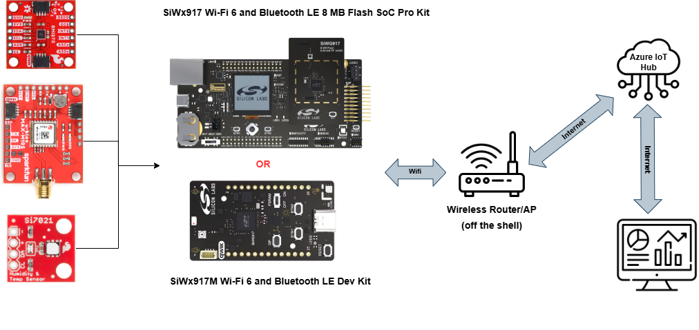
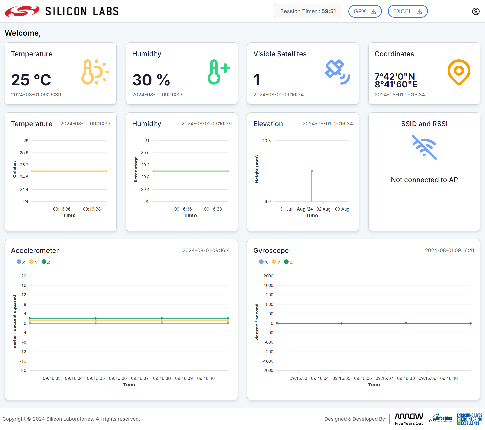

# Wi-Fi - Asset Tracking #

## Purpose-Scope ##

This application demonstrates how to configure the SiWG917 module as an Azure device endpoint and how to establish a connection with Azure IoT Hub. This project contains the development of a Wi-Fi tracker application on the SiWG917-PK6031A, that will be connected to Wi-Fi access point using WLAN APIs provided by the WiSeConnect 3 SDK. Communicates with Azure IoT Hub based on the configurations provided by the developer through the JSON messages containig the following fields.

- Wi-Fi MAC ID (as identifier)
- Current SSID and signal strength
- Current timestamp
- Latitude, longitude, elevation, and number of satellites visible
- Current humidity and temperature readings
- Values of accelerometer and gyroscope (X, Y, and Z-axis)
  
## Overview ##

### System Overview ###

> The following components should be set up to demonstrate Wi-Fi Asset Tracking end-to-end use-case using a SiWG917 device.

- **Azure Cloud**
  
    This example requires to create an Azure cloud account and then configure and create an Azure IoT Hub resource to receive data from the SiWG917 device. The Azure IoT Hub resource should be configured so that messages received from the SiWG917 device at the Azure IoT hub device will be routed back to its subscribers.

    [Azure Cloud Configuration Steps](https://github.com/SiliconLabs/wifi_applications/blob/main/wifi_asset_tracking/AZURE.md)

- **Dashboard**

    This application example provides a web-based dashboard application (frontend + backend) that subscribes to the Azure IoT Hub and receives and displays the sensor data on a frontend application in your browser.
    The frontend also provides an option to download session data and GPX files at dashboard application. You should sign in to the dashboard application using your Azure Cloud credentials to see the sensor data on the dashboard widgets.

    [Dashboard Configuration Steps](https://github.com/SiliconLabs/wifi_applications/blob/main/wifi_asset_tracking/dashboard/README.md)

- **SiLabs SiWG917 Device**
  
    SiWG917 SoC will get connected to multiple sensor modules like: SparkFun humidity and temperature sensor (Si7021), SparkFun GNSS receiver (MAX-M10S) and SparkFun 6DoF IMU (BMI270) using Qwiic connectors over I2C bus. SiWG917 device application will capture sensor data according to configured sample interval using an I2C bus. SiWG917 device will get connected to configured Wi-Fi to access the internet, and then it will get connected to the Azure IoT Hub. After that, captured sensor data will be converted to JSON format and will be sent to the Azure IoT Hub using the Message Queueing Telemetry Transport (MQTT) protocol.

    [Device Configuration Steps](https://github.com/SiliconLabs/wifi_applications/blob/main/wifi_asset_tracking/README.md#setup)

### Application Overview ###

Firmware application consists of three logical modules:

- **Sensor Module**
  
    This module is responsible for reading sensor and GNSS receiver data at a configured interval. Each sensor data will be read in a separate thread/task. The sensor data queue holds data read from each sensor thread. The JSON format converter thread reads data from the sensor data queue, converts sensor data to JSON format, and pushes JSON formatted data to the MQTT message queue.

- **Wi-Fi and connectivity management module**
  
    This module measures Wi-Fi parameters and pushes them to a message queue. It also forms keep-alive MQTT messages and sends them to the cloud at regular intervals. Depending on the complexity of the message interval, one or more threads can be used for message creation and connection management.

- **Message Queueing Telemetry Transport (MQTT) message sender module**
  
    This module sends messages to the Azure cloud. It contains a single thread that reads data from the MQTT message queue and sends it to the Azure IoT Hub.

    

## Hardware Requirements ##

- A Wireless Access Point
- SoC Model:
  - Standalone
    - [Si-MB4002A - Wireless pro kit mainboard](https://www.silabs.com/development-tools/wireless/wireless-pro-kit-mainboard?tab=overview)
    - [SiWx917-RB4338A - SiWx917 Wi-Fi 6 and Bluetooth LE SoC 8 MB Flash Radio Board](https://www.silabs.com/development-tools/wireless/wi-fi/siwx917-rb4338a-wifi-6-bluetooth-le-soc-radio-board?tab=overview)
  - Kits
    - [SiWx917-PK6031A - SiWx917 Wi-Fi 6 and Bluetooth LE 8 MB Flash SoC Pro Kit](https://www.silabs.com/development-tools/wireless/wi-fi/siwx917-pro-kit?tab=overview)
- [SparkFun Humidity and Temperature Sensor Breakout - Si7021](https://www.sparkfun.com/products/13763)
- [SparkFun GNSS Receiver Breakout - MAX-M10S (Qwiic)](https://www.sparkfun.com/products/18037)
- [SparkFun 6 Degrees of Freedom Breakout - BMI270 (Qwiic)](https://www.sparkfun.com/products/22397)
- [GPS/GNSS Magnetic Mount Antenna](https://www.sparkfun.com/products/14986)

## Software Requirements ##

- Simplicity Studio
  - Download the [Simplicity Studio v5 IDE](https://www.silabs.com/developers/simplicity-studio)
  - Follow the [Simplicity Studio User Guide](https://docs.silabs.com/simplicity-studio-5-users-guide/1.1.0/ss-5-users-guide-getting-started/install-ss-5-and-software#install-ssv5) to install Simplicity Studio IDE
- Follow these document to setup your [Azure Cloud](https://github.com/SiliconLabs/wifi_applications/blob/main/wifi_asset_tracking/AZURE.md) and [Dashboard](https://github.com/SiliconLabs/wifi_applications/blob/main/wifi_asset_tracking/dashboard/README.md)
- [Gecko SDK (GSDK) Version 4.4.3](https://github.com/SiliconLabs/gecko_sdk/releases/tag/v4.4.3)
- [WiSeConnect 3.2.0 SDK](https://docs.silabs.com/wiseconnect/3.2.0/wiseconnect-developers-guide-developing-for-silabs-hosts/)
- [Third Party Hardware Drivers Extension V3.0.1](https://github.com/SiliconLabs/third_party_hw_drivers_extension/releases/tag/v3.0.0)

## Setup ##

### Setup Diagram ###

Sparkfun Qwiic boards can be easily connected to each other using Qwiic cables. Then connect it all back to the SiWx917 Wi-Fi 6 and Bluetooth LE 8 MB Flash SoC Pro Kit board as shown in the table below:

| Description  | BRD4338A GPIO | BRD4002 EXP Header | SparkFun Qwiic boards |
| -------------| ------------- | ------------------ | ------------------ |
| I2C_SDA      | ULP_GPIO_6    | EXP_16             | SDA                |
| I2C_SCL      | ULP_GPIO_7    | EXP_15             | SCL                |

The final setup of the system is shown in the image below:

To test this application, you can either create a project based on an example project or start with a "SL Si91x - Empty C Project SoC" project.

### Create a project based on an example project ###

1. From the Launcher Home, add the BRD4338A to My Products, click on it, and click on the **EXAMPLE PROJECTS & DEMOS** tab. Find the example project filtering by "asset".

2. Click **Create** button on the **Wi-Fi - Asset Tracking** example. Example project creation dialog pops up -> click Create and Finish and Project should be generated.

    

3. From the project root folder, open file "config/sl_net_default_values.h" change 2 macros "DEFAULT_WIFI_CLIENT_PROFILE_SSID" and "DEFAULT_WIFI_CLIENT_CREDENTIAL" match with your WIFI SSID and WIFI PASSPHRASE.

    - "DEFAULT_WIFI_CLIENT_PROFILE_SSID" refers to the name with which Wi-Fi network that shall be advertised and Si91X module is connected to it.
    - "DEFAULT_WIFI_CLIENT_CREDENTIAL" refers to the secret key if the AP is configured in WPA-PSK/WPA2-PSK security modes.

    

4. From the project root folder, open file "sl_wifi_asset_tracking_demo_config.h" change 3 macros "DEMO_CONFIG_IOT_HUB_HOST_NAME", "DEMO_CONFIG_DEVICE_ID" and "DEMO_CONFIG_DEVICE_SYMMETRIC_KEY" match with your Azure Cloud configuration ("[Refer to this document](https://github.com/SiliconLabs/wifi_applications/blob/main/wifi_asset_tracking/AZURE.md)")

    

5. Build and flash this example to the board.

### Start with a "SL Si91x - Empty C Project SoC" project ###

1. Create a **SL Si91x - Empty C Project SoC** project for BRD4338A using Simplicity Studio 5.

2. Copy all of source files in "wifi_asset_tracking/src" and header files in "wifi_asset_tracking/inc" to the directory of the project root folder (overwriting the existing files).

3. Install the software components:

    - Open the .slcp file in the project.

    - Select the SOFTWARE COMPONENTS tab.

    - Install the following components:

        - [WiSeConnect 3 SDK] → [Device] → [Si91x] → [MCU] → [Peripheral] → [I2C] → [i2c2]
        - [Third Party Hardware Drivers] → [Wireless Connectivity] → [MAX-M10S - GNSS Receiver Breakout - I2C]
        - [Third Party Hardware Drivers] → [Sensor] → [BMI270 - 6DOF IMU Breakout (Sparkfun)]
        - [WiSeConnect 3 SDK] → [Device] → [Si91x] → [Wireless] → [Buffer Manager] → [Memory Pool Buffers]
        - [WiSeConnect 3 SDK] → [Third Party] → [AZURE FreeRTOS Middleware]
        - [WiSeConnect 3 SDK] → [Service] → [Network Management] → [Configuration] → [Basic Network Configuration Manager]
        - [WiSeConnect 3 SDK] → [Device] → [Si91x] → [MCU] → [Hardware] → [Memory LCD SPI driver]
        - [WiSeConnect 3 SDK] → [Device] → [Si91x] → [MCU] → [Peripheral] → [Calendar]
        - [WiSeConnect 3 SDK] → [Device] → [Si91x] → [MCU] → [Hardware] → [Si70xx Humidity and Temperature Sensor]
        - [WiSeConnect 3 SDK] → [Device] → [Si91x] → [Wireless] → [Crypto] → [HMAC]
        - [WiSeConnect 3 SDK] → [Device] → [Si91x] → [MCU] → [Core] → [Peripheral] → [ULP Timer] → [timer0]
        - [WiSeConnect 3 SDK] → [Service] → [SNTP Client]
        - [WiSeConnect 3 SDK] → [Resources] → [WiSeConnect3 Resources]
        - [WiSeConnect 3 SDK] → [Device] → [Si91x] → [MCU] → [Service] → [Power Manager] → [ULP Peripheral] → [ULP SSI]
        - [Application] → [Utility] → [Assert]
        - [Platform] → [Driver] → [GLIB Graphics Library]
        - [RTOS] →  [FreeRTOS] → [FreeRTOS Heap 4]

4. From the project root folder, open file "config/sl_net_default_values.h" change 2 macros "DEFAULT_WIFI_CLIENT_PROFILE_SSID" and "DEFAULT_WIFI_CLIENT_CREDENTIAL" match with your WIFI SSID and WIFI PASSPHRASE

    - "DEFAULT_WIFI_CLIENT_PROFILE_SSID" refers to the name with which Wi-Fi network that shall be advertised and Si91X module is connected to it.
    - "DEFAULT_WIFI_CLIENT_CREDENTIAL" refers to the secret key if the AP is configured in WPA-PSK/WPA2-PSK security modes.

    

5. From the project root folder, open file "sl_wifi_asset_tracking_demo_config.h" change 3 macros "DEMO_CONFIG_IOT_HUB_HOST_NAME", "DEMO_CONFIG_DEVICE_ID" and "DEMO_CONFIG_DEVICE_SYMMETRIC_KEY" match with your Azure Cloud configuration ([Refer to this document](https://github.com/SiliconLabs/wifi_applications/blob/main/wifi_asset_tracking/AZURE.md))

    

6. Build and flash this example to the board.

## How It Works ##

After you flash the code to your board and power the connected boards, the application starts running automatically. Use Putty/Tera Term (or another program) to read the values of the serial output. Note that your board uses the default baud rate of 115200. First, the main program initializes the driver, reads some information and checks communication with the sensors. After that, it tries to establish connection to your Wi-Fi access point (AP). If the connection is successfully established with the access point, the main program sends the data to the Azure Cloud periodically. Then, it is possible to use the dashboard to view the data ([Refer to this document](https://github.com/SiliconLabs/wifi_applications/blob/main/wifi_asset_tracking/dashboard/README.md)).

There is a periodic timer in the code, which determines the transmitting intervals; the default transmitting intervals rate is defined in "sl_wifi_asset_tracking_demo_config.h". If you need more frequent transmit, change the value of the corresponding parameters as follows.

- The default Wi-Fi sampling interval is 60 seconds. To change the interval, add new value in the range of 60 and 600 seconds.

- The default Si7021 Temperature and RH sensor sampling interval is 5 seconds. To change the interval, add new value in the range of 5 and 120 seconds.

- The default BMI270 6DoF IMU sensor sampling interval is 1 second. To change the interval, add new value in the range of 1 and 60 seconds.

- The default MAX-M10S GNSS receiver sampling interval is 60 seconds. To change the interval, add new value in the range of 60 and 600 seconds.

## Note ##

- When firmware application starts and connects to the Wi-Fi access point, the application fetches the current timestamp using the SNTP server. If the device failed to fetch the timestamp from the SNTP server within 7 seconds, the device configures a timestamp "2000-01-01T00:00:00.000Z". It is possible to reset the device or restart the application multiple times to get a valid current timestamp. The fetched timestamp is visible at the console logs and in the dashboard application.

- In case when user started the firmware device before the dashboard aplication then all of those messages which has published before dashboard application started will be laps out and will not appear on dashboard. so till the time message were tackle by backend you might see idle dashboard.

## Console Log ##

The screenshot of the console is shown in the images below:

### Sensors Module Initialization ###

 

### Wi-Fi Initialization ###

 

### Keep-Alive and Wi-Fi Status ###

 

### Temperature and Humidity Sensor ###

 

### GNSS Receiver Sensor ###

 

### 6 Degrees of Freedom Breakout Sensor ###

 

## LCD Snapshot ##

 

## Dashboard Overview ##

 

## Report Bugs & Get Support ##

To report bugs in the Application Examples projects, please create a new "Issue" in the "Issues" section of [wifi_applications](https://github.com/SiliconLabs/wifi_applications) repo. Please reference the board, project, and source files associated with the bug, and reference line numbers. If you are proposing a fix, also include information on the proposed fix. Since these examples are provided as-is, there is no guarantee that these examples will be updated to fix these issues.

Questions and comments related to these examples should be made by creating a new "Issue" in the "Issues" section of [wifi_applications](https://github.com/SiliconLabs/wifi_applications) repo.
