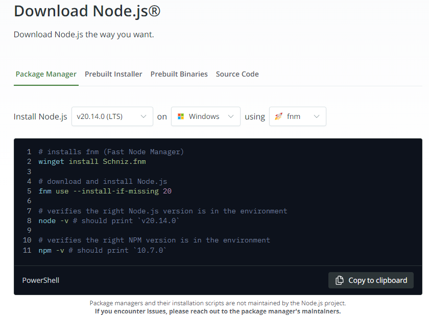
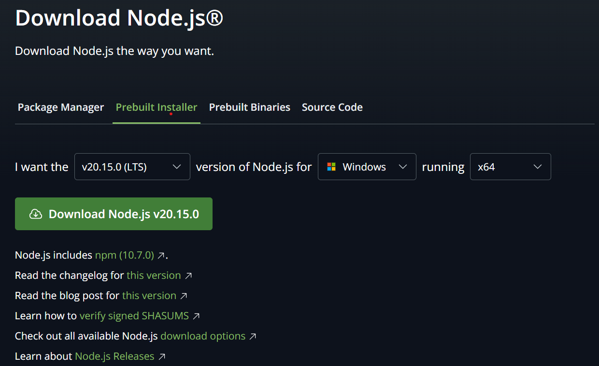
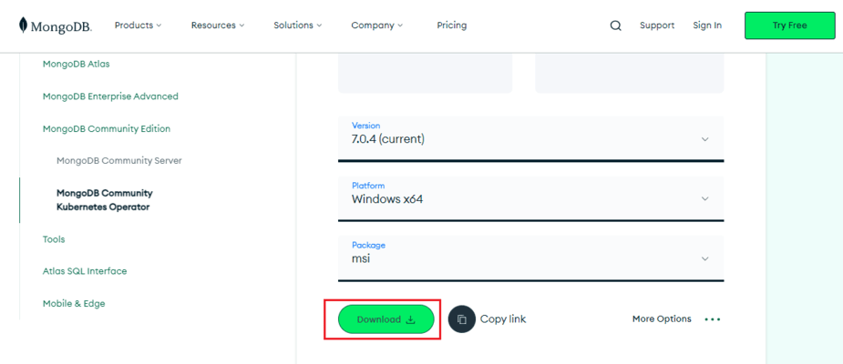
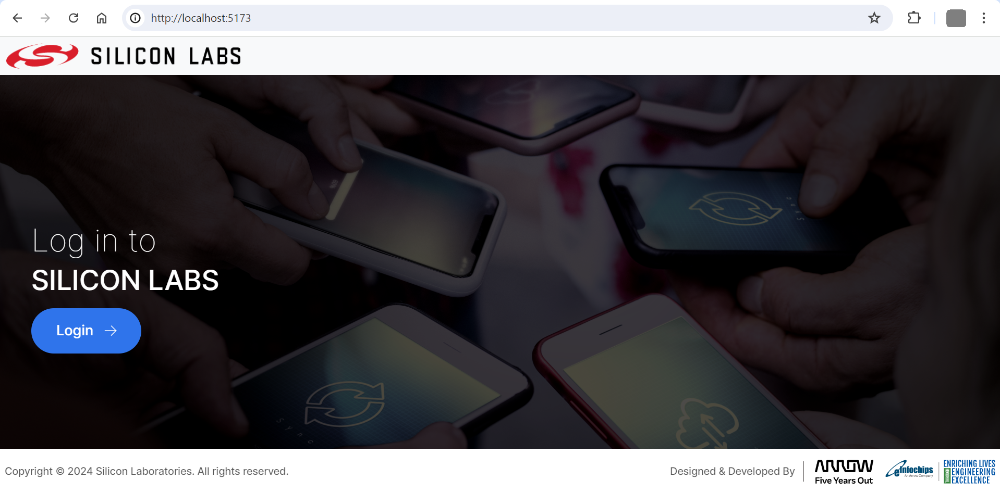
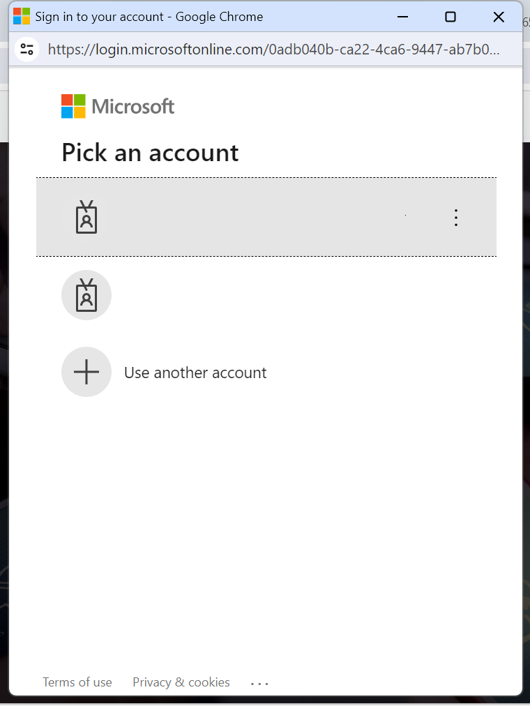
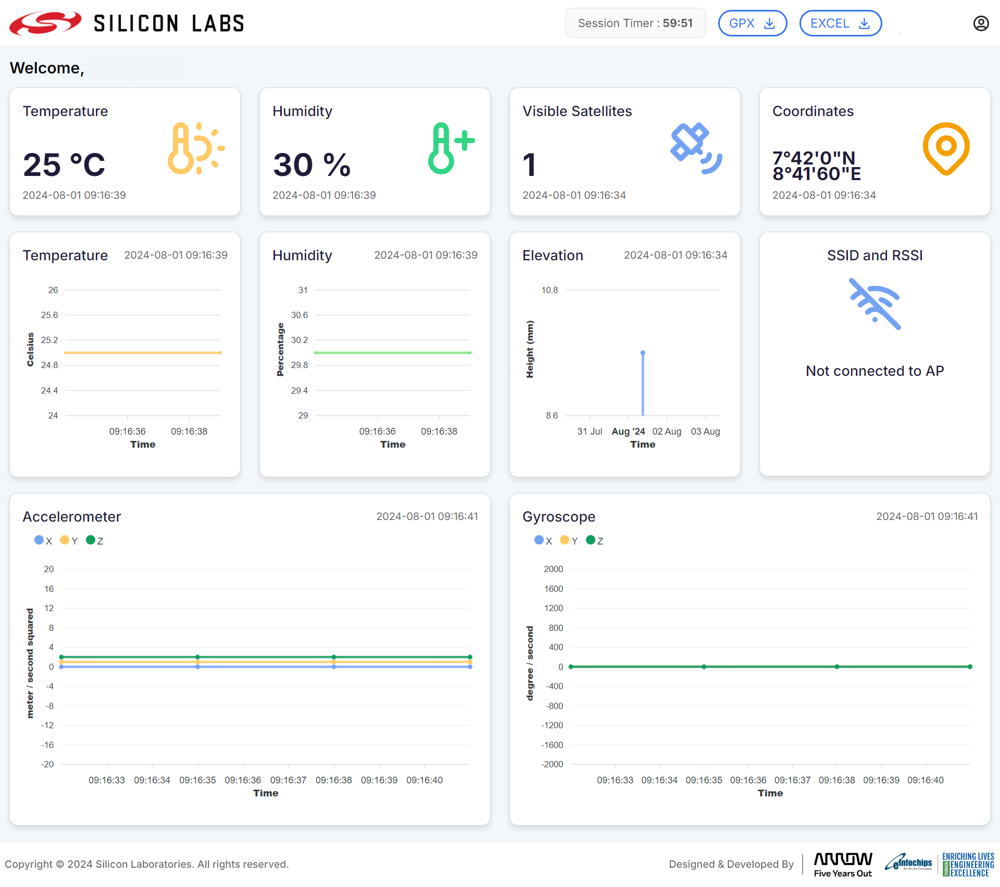
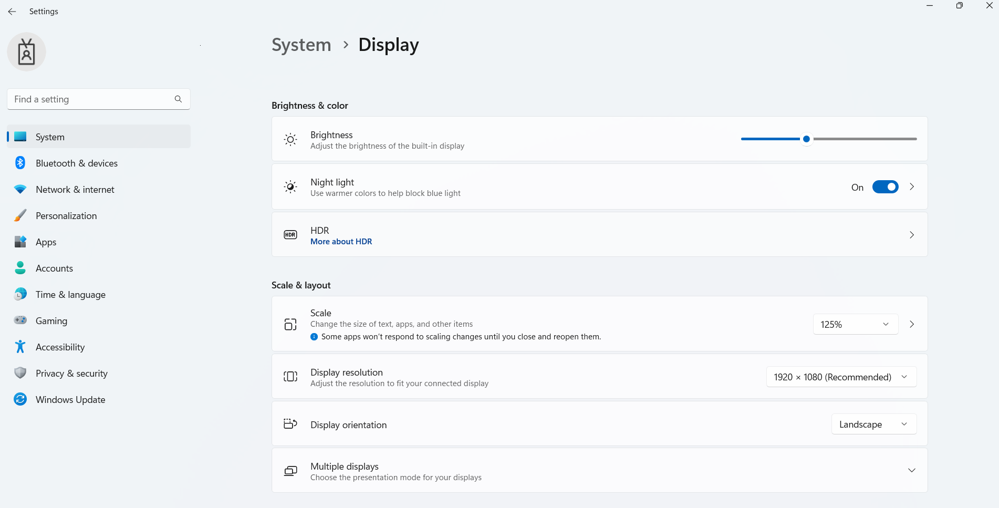
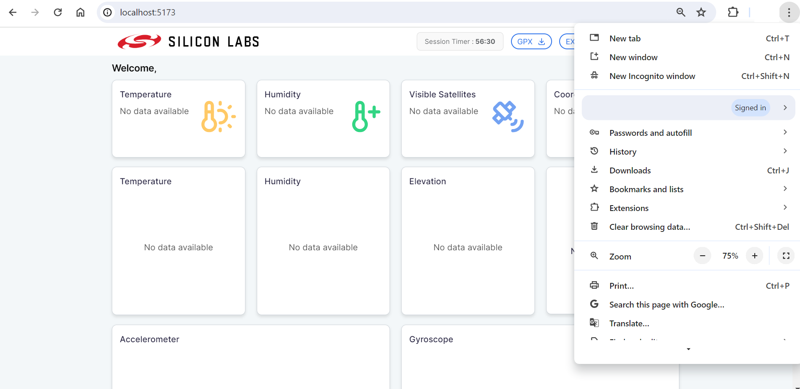

# Wi-Fi - Asset Tracking - Dashboard #

## Description ##

This README file demonstrates the steps to set up the backend and frontend to run the dashboard application.

### Table of Contents ###

- [Description](https://github.com/SiliconLabs/wifi_applications/blob/main/wifi_asset_tracking/dashboard/README.md#description)
  - [Table of Contents](https://github.com/SiliconLabs/wifi_applications/blob/main/wifi_asset_tracking/dashboard/README.md#table-of-contents)
- [Purpose/Scope](https://github.com/SiliconLabs/wifi_applications/blob/main/wifi_asset_tracking/dashboard/README.md#purposescope)
- [Prerequisites](https://github.com/SiliconLabs/wifi_applications/blob/main/wifi_asset_tracking/dashboard/README.md#prerequisites)
  - [Hardware Requirements](https://github.com/SiliconLabs/wifi_applications/blob/main/wifi_asset_tracking/dashboard/README.md#hardware-requirements)
  - [Software Requirements](https://github.com/SiliconLabs/wifi_applications/blob/main/wifi_asset_tracking/dashboard/README.md#software-requirements)
  - [Azure Cloud Configuration](https://github.com/SiliconLabs/wifi_applications/blob/main/wifi_asset_tracking/AZURE.md#azure-account-creation)
  - [Azure App Registration](https://github.com/SiliconLabs/wifi_applications/blob/main/wifi_asset_tracking/AZURE.md#azure-app-registration)
- [Installation of NodeJs](https://github.com/SiliconLabs/wifi_applications/blob/main/wifi_asset_tracking/dashboard/README.md#installation-of-nodejs)
- [Installation of MongoDB Community Server Version 7.0](https://github.com/SiliconLabs/wifi_applications/blob/main/wifi_asset_tracking/dashboard/README.md#installation-of-mongodb-community-server-version-70)
- [Getting Started](https://github.com/SiliconLabs/wifi_applications/blob/main/wifi_asset_tracking/dashboard/README.md#getting-started)
  - [Create .env file for backend](https://github.com/SiliconLabs/wifi_applications/blob/main/wifi_asset_tracking/dashboard/README.md#create-env-file-for-backend)
  - [Create .env file for frontend](https://github.com/SiliconLabs/wifi_applications/blob/main/wifi_asset_tracking/dashboard/README.md#create-env-file-for-frontend)
  - [Run the Backend Application](https://github.com/SiliconLabs/wifi_applications/blob/main/wifi_asset_tracking/dashboard/README.md#run-the-backend-application)
  - [Run the Frontend application](https://github.com/SiliconLabs/wifi_applications/blob/main/wifi_asset_tracking/dashboard/README.md#run-the-frontend-application)
  - [Browser Usage](https://github.com/SiliconLabs/wifi_applications/blob/main/wifi_asset_tracking/dashboard/README.md#browser-usage)
- [Test the Application](https://github.com/SiliconLabs/wifi_applications/blob/main/wifi_asset_tracking/dashboard/README.md#test-the-application)
- [API Documentation](https://github.com/SiliconLabs/wifi_applications/blob/main/wifi_asset_tracking/dashboard/README.md#api-documentation)

## Purpose/Scope ##

This application demonstrates how to configure the Azure device with IoT hub and how to receive all the device sensor message on the backend node server and display this on client side. Also, it demonstrates the chart representation of Temperature, Humidity, Elevation, Accelerometer and Gyroscope reading. It will show latest 10 data points on the chart. Also, it will contain download feature to download session data and GPX file.

## Prerequisites ##

### Hardware Requirements ###

- A Windows/Linux/Mac PC

  - **Windows**
    - Windows 10 or newer
  - **Linux**
    - Ubuntu 20.04 LTS or newer
  - **macOS**
    - macOS 11 or newer

- System config
  - Processor:- 1 GHZ or faster, 64-bit processor.
- Active Internet connection

### Software Requirements ###

- Install Nodejs >= v20.14.0 LTS
  - Install [Nodejs](#installation-of-nodejs)
- Install MongoDB >= 7.0 LTS
  - Install [MongoDB](#installation-of-mongodb-community-server-version-70)

### Azure Cloud Configuration and App Registration ###

> **Note**
>
> - Please follow the [Azure Cloud readme](https://github.com/SiliconLabs/wifi_applications/blob/main/wifi_asset_tracking/AZURE.md) to setup cloud configuration

## Installation of NodeJs ##

To download the Node.js installer, visit the [official Node.js website](https://nodejs.org/en/download/package-manager)



### Installing Node.js on Windows ###

1. Go to Prebuilt Installer and Select the version v20.15.0 (LTS) (*If the version is not available, choose the nearest higher LTS version instead*)

   

2. Click on Download button to download the node version.

3. Double-click the downloaded installer and follow the prompts to install Node.js.

4. Run the following command in your command prompt or Windows PowerShell to check the installed version

   ```bash
     node --version
   ```

### Installing Node.js on Linux ###

Run following command in your terminal to install Node.js.

```bash
# installs nvm (Node Version Manager)
curl -o- https://raw.githubusercontent.com/nvm-sh/nvm/v0.39.7/install.sh | bash

# download and install Node.js (you may need to restart the terminal)
nvm install 20

# verifies the right Node.js version is in the environment
node -v # should print version of installed NodeJS

# verifies the right NPM version is in the environment
npm -v # should print version of installed NPM
```

### Installing Node.js on macOs ###

Run following command in your terminal to install Node.js.

```bash
# download and install Node.js
brew install node@20

# verifies the right Node.js version is in the environment
node -v # should print version of installed NodeJS

# verifies the right NPM version is in the environment
npm -v # should print version of installed NPM
```

>**Note**
>
>- Homebrew is not a Node.js package manager. Please ensure it is already installed on your system. Follow official instructions at <https://brew.sh/>
>

## Installation of MongoDB Community Server Version 7.0 ##

### Installing MongoDB on Windows ###

1. Go to the [MongoDB Download Center](https://www.mongodb.com/try/download/community) to download the MongoDB Community Server.

   

   Choose the compatible version as below
     - Version: 7.0.11(current)(*If the version is not available, choose the nearest higher version instead*)
     - Platform: Windows x64
     - Package: msi

2. Click on Download button to download the MongoDB version.
3. Double-click the downloaded installer and follow the prompts to install MongoDB.
4. Launch MongoDB Compass from your applications folder or start menu

### Installing MongoDB on Ubuntu ###

1. From a terminal, install gnupg and curl if they are not already available:

   ```bash
    sudo apt-get install gnupg curl
   ```

   To import the MongoDB public GPG key, run the following command:

   ```bash
    curl -fsSL https://www.mongodb.org/static/pgp/server-7.0.asc | \
    sudo gpg -o /usr/share/keyrings/mongodb-server-7.0.gpg \
      --dearmor
   ```

2. Create a list file for MongoDB

   - For Ubuntu 22.04

     ```bash
     echo "deb [ arch=amd64,arm64 signed-by=/usr/share/keyrings/mongodb-server-7.0.gpg ] https://repo.mongodb.org/apt/ubuntu jammy/mongodb-org/7.0  multiverse" | sudo tee /etc/apt/sources.list.d/mongodb-org-7.0.list
     ```

   - For Ubuntu 20.04

     ```bash
     echo "deb [ arch=amd64,arm64 signed-by=/usr/share/keyrings/mongodb-server-7.0.gpg ] https://repo.mongodb.org/apt/ubuntu focal/mongodb-org/7.0 multiverse" | sudo tee /etc/apt/sources.list.d/mongodb-org-7.0.list
     ```

3. Reload local package database

    ```bash
    sudo apt-get update
    ```

4. Install the MongoDB packages

    ```bash
    sudo apt-get install -y mongodb-org
    ```

5. Run MongoDB Community Edition

    ```bash
      sudo systemctl start mongod
    ```

6. Run the below command to check the running status of MongoDB

    ```bash
    sudo systemctl status mongod
    ```

### Installing MongoDB on macOS ###

1. Download the official Homebrew formula for MongoDB and the Database Tools, by running the following command in your macOS Terminal:

    ```bash
    brew tap mongodb/brew
    ```

2. Update Homebrew and all existing formulae:

    ```bash
    brew update
    ```

3. To install MongoDB, run the following command in your macOS Terminal application:

    ```bash
    brew install mongodb-community@7.0
    ```

4. Run MongoDB (i.e. the mongod process) as a macOS service, run:

    ```bash
    brew services start mongodb-community@7.0
    ```

## Getting Started ##

### Create .env file for backend ###

1. Go to [project-root-folder]/dashboard/backend
2. Create .env file
3. Add the following lines in .env file and replace the placeholders with your actual values

    ```bash
      PORT="<Port for running application>"
      DB_URL="<Database URL>"
      JWT_SECRET="<Your JWT Secret Key>"
      NODE_ENV="<Environment for running application development/production>"
      IS_LOG_TO_ENABLED="<Keep it true to enable logging.>"
      IOT_CONSUMER_GROUP="$Default"

      STORAGE_CONNECTION_STRING="<Copied STORAGE_CONNECTION_STRING>"

      CONTAINER_NAME="<Copied CONTAINER_NAME>"

      IOT_EVENT_HUB_ENDPOINT="<Copied IOT_EVENT_HUB_ENDPOINT>"

      DEFAULT_DEVICE_ID="<Copied IOT_EVENT_HUB_ENDPOINT>"
    ```

    >**Note**
    >
    >- **PORT**: The port number on which your application will run (e.g., 3005).
    >- **DB_URL**: The URL of your database (e.g., mongodb://localhost:27017/silabs).
    >- **JWT_SECRET**: A secure and random secret key used for signing JWTs (e.g., 7cCqr=d6^STA).
    >- **NODE_ENV**: The environment in which your application is running. Use development for development and production for production (e.g., development).
    >- **IS_LOG_TO_ENABLED**: Set to true to enable logging or false to disable it (e.g., true).
    >- **IOT_CONSUMER_GROUP**: Keep this as "$Default".

**Refer [Azure Cloud readme](https://github.com/SiliconLabs/wifi_applications/blob/main/wifi_asset_tracking/AZURE.md) to know all the steps to get these ENV values**

- STORAGE_CONNECTION_STRING
- CONTAINER_NAME
- IOT_EVENT_HUB_ENDPOINT
- DEFAULT_DEVICE_ID

### Create .env file for frontend ###

- Create and configure .env file

  - Go to [project-root-folder]/dashboard/frontend
  - Create .env file
  - Add Application (client) ID and Directory (tenant) ID details on .env file which we will get while azure app registration

    ```c
    VITE_CLIENT_ID= "<Your Application (client) ID>"
    VITE_TENANT_ID= "<Your Directory (tenant) ID>"
    ```

### Run the Backend Application ###

1. Go to [project-root-folder]/dashboard/backend
2. Open Terminal/Cmd/Poweshell/Bash Here
3. Run this command

    ```bash
    # install all dependencies
    npm install

    # development
    $ npm run start

    # watch mode
    $ npm run start:dev

    # production mode
    $ npm run build
    $ npm run start:prod
    ```

### Run the Frontend application ###

- Go to [project-root-folder]/dashboard/frontend
- Open Terminal/Cmd/Poweshell/Bash Here
- Run below command to install all dependencies

  ```bash
  npm install
  ```

- Run below command to start dashboard application

  ```bash
   npm run dev
  ```

- After running above commands, you can open your chrome browser and type <http://localhost:5173/> where you can see login page of our dashboard application.

### Browser Usage ###

- Please use the normal browsing mode of your browser to run this application. Incognito or private browsing modes are not supported and may cause issues with functionality.
- Please avoid switching browsers within a single session to prevent disruptions.

  

- Click on the login button and it will open Microsoft login popup and enter your credentials

  

- After successful login, you will see dashboard page as below where you will see charts for Temperature, Humidity, Elevation, Accelerometer, Gyroscope and Wi-Fi details.

  

### Note ###

Optimal Viewing Settings for 1080p Resolution on Windows and Linux

- System Display Scale: Set to 125%
- Browser Zoom Level: Set to 75%
- View in Fullscreen Mode

  - Steps to setup Optimal Viewing Settings for 1080p Resolution on Windows

    - Open Settings.
    - Click on System.
    - Click on Display.
    - Under the "Scale and layout" section, use the drop-down menu and select the scale 125%.

      

    - Navigate to the dashboard application tab in Chrome browser
    - Click on the three vertical dots in the top right corner of the browser window.
    - Find the "Zoom" option in the dropdown menu.
    - Click the '+' or '-' button to adjust the zoom to 75%, then click on the 'Full screen' icon (a square), which is to the right of the zoom option.

      

### Important Warning ###

> In case when user started the firmware device before the dashboard application then all of those messages which has published before dashboard application started will be laps out and will not appear on dashboard. So, till the time message were tackle by backend you might see idle dashboard.

## Test the Application ##

```bash
# unit tests
$ npm run test

# test coverage
$ npm run test:cov
```

## API Documentation ##

**Note:**
Please run the backend application to access the API documentation.

Documentation Link - <http://localhost:3005/api/v1/swagger>
