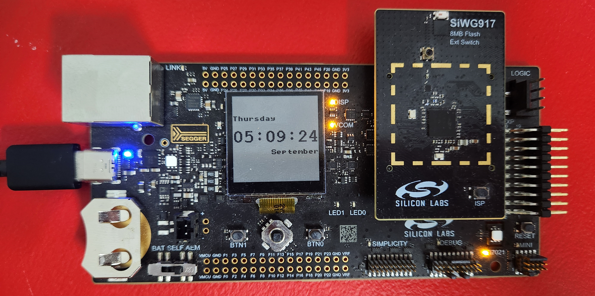
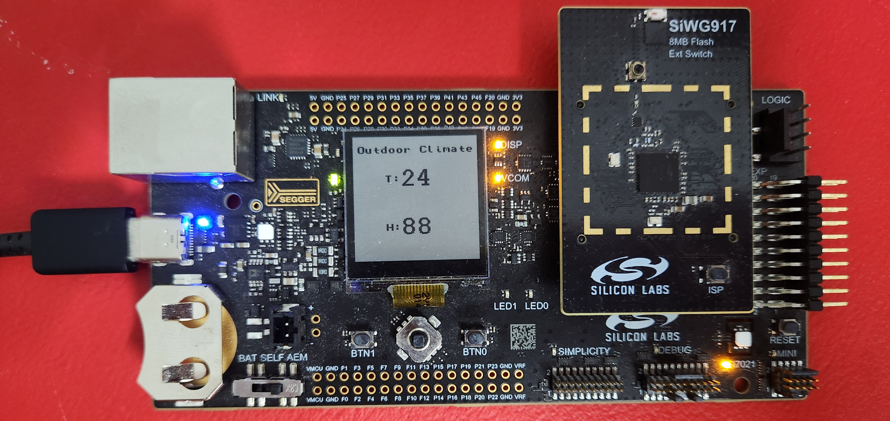
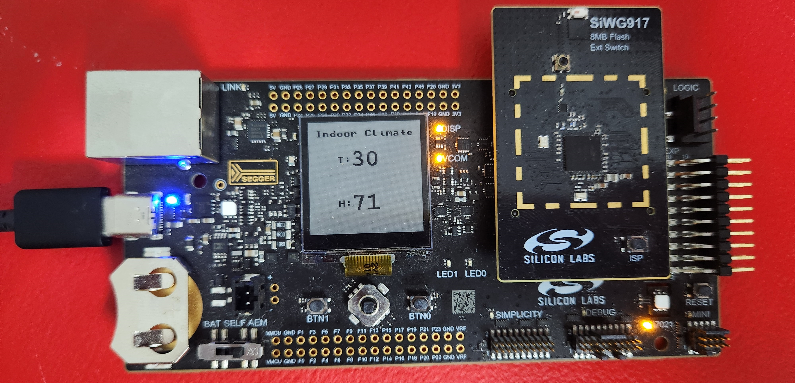
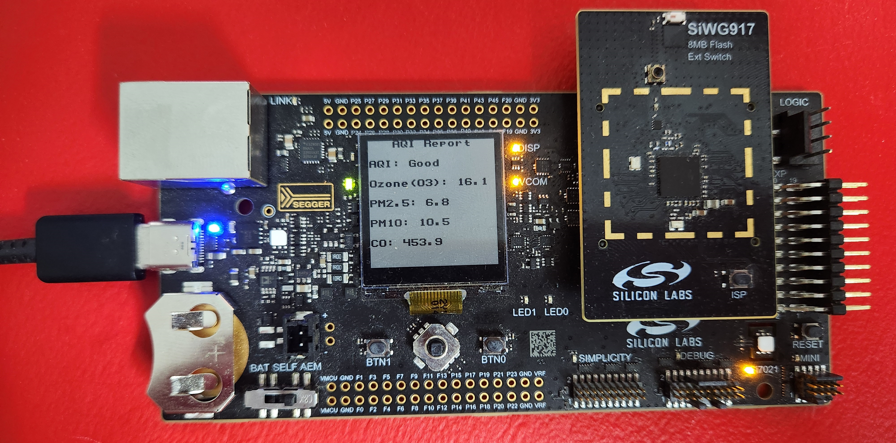

# Wi-Fi - Weather Display #


## Table of Contents ##

- [PurposeScope](#purpose-scope)
- [Overview](#overview)
  - [System Overview](#system-overview)
  - [Application Overview](#application-overview)
- [Hardware Requirements](#hardware-requirements)
- [Software Requirements](#software-requirements)
- [Setup](#setup)
  - [Connections Required](#connections-required)
  - [Create a project based on an example project](#create-a-project-based-on-an-example-project)
  - [Create a project based on the Wi-Fi - HTTP Client (SoC) project](#create-a-project-based-on-the-wi-fi---http-client-soc-project)
- [Application Configurations](#application-configurations)
- [How It Works](#how-it-works)
  - [Console Log](#how-it-works)
- [Note](#note)
  - [If SNTP fetch fails](#if-sntp-fetch-fails)
  - [Generating an API key](#generating-an-api-key)
  - [CA Certificate Information](#ca-certificate-information)

## Purpose-Scope ##

This project demonstrates a weather display powered by the SiWx917 microcontroller. It retrieves real-time weather data from the OpenWeatherMap API, synchronizes the current date and time using the NTP protocol, and monitors indoor temperature and humidity using the Si70xx sensor on the development kit.

### Key Features ###

- **External Weather Data:** Obtained from OpenWeatherMap API over HTTP, including temperature, humidity, and other meteorological information.

- **Indoor Environment Monitoring:** The Si70xx temperature and humidity sensor on the development kit provides accurate indoor data.

- **NTP Time Synchronization:** Displays the current date and time using the network time protocol. This project showcases the capabilities of SiWx917 platforms in IoT and smart home applications, integrating both real-time external weather data and local indoor environmental monitoring.

## Overview ##


### System Overview ###

- **SiLabs SiWG917 Device**
  
    The SiWx917 SoC is configured to interface with the Si7021 sensor on the development kit. The device captures sensor data at configured intervals via I2C. It connects to Wi-Fi to access the internet, retrieves weather and air quality data (AQI) via HTTPS, and synchronizes the current date and time using NTP. The data is then displayed on the LCD (if using the SiWx917 Wi-Fi 6 and Bluetooth LE 8 MB Flash SoC Pro Kit) or on the log console (if using the SiWx917M Wi-Fi 6 and Bluetooth LE Dev Kit).

### Application Overview ###

The firmware consists of three RTOS tasks:

- **Device Initialization**
  
    Initializes the Wi-Fi interface, Si7021 sensor, and LCD display. It then retrieves weather and AQI data via HTTPS and synchronizes the date and time via NTP.

- **App Process**
  
    Manages display updates and state transitions based on button presses.

- **Data Update**
  
    Periodically updates the weather, AQI, and network time data based on the ```#define DATA_UPDATE_TIMEOUT``` value.

## SDK version ##

SiSDK v2024.12.0

## Hardware Requirements ##

- A Wireless Access Point
- SoC Model:
  - Standalone
    - [Si-MB4002A - Wireless pro kit mainboard](https://www.silabs.com/development-tools/wireless/wireless-pro-kit-mainboard?tab=overview)
    - [SiWx917-RB4338A - SiWx917 Wi-Fi 6 and Bluetooth LE SoC 8 MB Flash Radio Board](https://www.silabs.com/development-tools/wireless/wi-fi/siwx917-rb4338a-wifi-6-bluetooth-le-soc-radio-board?tab=overview)
  - Kits
    - [SiWx917-PK6031A - SiWx917 Wi-Fi 6 and Bluetooth LE 8 MB Flash SoC Pro Kit](https://www.silabs.com/development-tools/wireless/wi-fi/siwx917-pro-kit?tab=overview)

    OR
    - [SiWx917-DK2605A - SiWx917M Wi-Fi 6 and Bluetooth LE Dev Kit](https://www.silabs.com/development-tools/wireless/wi-fi/siwx917-dk2605a-wifi-6-bluetooth-le-soc-dev-kit?tab=overview)

## Software Requirements ##

- Simplicity Studio
  - Download the [Simplicity Studio v5 IDE](https://www.silabs.com/developers/simplicity-studio)
  - Follow the [Simplicity Studio User Guide](https://docs.silabs.com/simplicity-studio-5-users-guide/1.1.0/ss-5-users-guide-getting-started/install-ss-5-and-software#install-ssv5) to install Simplicity Studio IDE
- [Simplicity SDK Version 2024.12.0](https://github.com/SiliconLabs/simplicity_sdk/releases/tag/v2024.12.0)
- [WiSeConnect 3 SDK extension version 3.4.0](https://github.com/SiliconLabs/wiseconnect/releases/tag/v3.4.0)

> NOTE: The project has been only built and tested with [Simplicity SDK Version 2024.12.0](https://github.com/SiliconLabs/simplicity_sdk/releases/tag/v2024.12.0) and [WiSeConnect 3 SDK extension version 3.4.0](https://github.com/SiliconLabs/wiseconnect/releases/tag/v3.4.0).

## Setup ##

### Connections Required ###

Connect the **SiWx917 Wi-Fi 6 and Bluetooth LE 8 MB Flash SoC Pro Kit** or the **SiWx917M Wi-Fi 6 and Bluetooth LE Dev Kit** to the PC through a USB type C cable. To test this application, you can either create a project based on an example project or start with a "Wi-Fi - HTTP Client (SoC)" project.

### Create a project based on an example project ###

1. From the Launcher Home, add your board to My Products, click on it, and click on the **EXAMPLE PROJECTS & DEMOS** tab. Find the example project filtering by "weather display".

2. Click **Create** button on the **Wi-Fi - Weather Display** example. Example project creation dialog pops up -> click Create and Finish and Project should be generated.

    

3. Build and flash this example to the board.

### Create a project based on the Wi-Fi - HTTP Client (SoC) project ###

1. Create the Wi-Fi HTTP Client (SoC) project for the SiWx917 in Simplicity Studio.

2. Copy all the files in the `wifi_weather_display/inc` and `wifi_weather_display/src` folder into the project folder, overwriting the existing files.

3. Open the *.slcp file. Select the SOFTWARE COMPONENTS tab and install the software components:
    - [WiSeConnect 3 SDK v3.4.0] → [Service] → [SNTP Client]
    
    - [Platform] → [Driver] → [GLIB Graphics Library] (**if using the SiWx917 Wi-Fi 6 and Bluetooth LE 8 MB Flash SoC Pro Kit - BRD4338A**)
    
    - [Platform] → [Driver] → [GLIB driver for Memory LCD] (**if using the SiWx917 Wi-Fi 6 and Bluetooth LE 8 MB Flash SoC Pro Kit - BRD4338A**)
    
    - [WiSeConnect 3 SDK v3.4.0] → [Device] → [Si91x] → [Hardware] → [Memory LCD SPI driver] (**if using the SiWx917 Wi-Fi 6 and Bluetooth LE 8 MB Flash SoC Pro Kit - BRD4338A**)
    
    - [WiSeConnect 3 SDK v3.4.0] → [Device] → [Si91x] → [peripheral] → [SSI]
    
    - [WiSeConnect 3 SDK v3.4.0] → [Device] → [Si91x] → [Hardware] → [Si70xx Humidity and Temperature Sensor]
    
    - [WiSeConnect 3 SDK v3.4.0] → [Device] → [Si91x] → [peripheral] → [I2C] (Configure the I2C instance to "i2c2")
    
    
    - [WiSeConnect 3 SDK v3.4.0] → [Device] → [Si91x] → [peripheral] → [ULP Timer] (Configure the ULP timer instance to "timer0")
    
    
    - [WiSeConnect 3 SDK v3.4.0] → [Device] → [Si91x] → [peripheral] → [Calendar]
    
    - [WiSeConnect 3 SDK v3.4.0] → [Device] → [Si91x] → [MCU] → [Service] → [Sleep Timer for Si91x]
    
    - [WiSeConnect 3 SDK v3.4.0] → [Device] → [Si91x] → [MCU] → [Hardware] → [Button] (Configure the Button instance to "btn0")
    
    

4. If user using the SiWx917 Wi-Fi 6 and Bluetooth LE 8 MB Flash SoC Pro Kit - BRD4338A:

    In Project Explorer → select project "wifi_weather_display" → right click and select "Properties" → C/C++ Build → Settings → GNU ARM C Compiler → Preprocessor → Click Add button then add this macro "APP_ENABLE_DISPLAY_DATA=1" → click Apply.

    

5. Copy the cacert.pem.h file to the resources/certificates folder of the WiSeConnect SDK.
6. Build and flash the project onto the board.

## Application Configurations ##

The application can be customized according to user requirements and the development environment.

In the **sl_net_default_values.h** file located in the config folder, update the following parameters to connect your Silicon Labs Wi-Fi device to a Wi-Fi network:

- **SSID:** Define the network name (SSID) the Si91x module connects to:

  ```c
    #define DEFAULT_WIFI_CLIENT_PROFILE_SSID               "YOUR_AP_SSID"     
  ```

- **Wi-Fi Credentials:** Define the Wi-Fi password if using WPA-PSK/WPA2-PSK security:

  ```c
    #define DEFAULT_WIFI_CLIENT_CREDENTIAL                 "YOUR_AP_PASSPHRASE" 
  ```

- **Security Type:** Specify the Wi-Fi security type:

  ```c
    #define DEFAULT_WIFI_CLIENT_SECURITY_TYPE              SL_WIFI_WPA2 
  ```

### Configuring the Weather API ##

- Define your location's latitude, longitude, and the API key from OpenWeatherMap in the app.c file:

  ```c
  // Define the latitude, longitude, and API key
  char *latitude = "xx.xxx";
  char *longitude = "xx.xxx";
  char *api_key = "xxxxxxxxxxxxxxxxxxxxxxx";  // Replace with your actual API key
  ```

> NOTE: Refer to the end of the readme on [how to generate an OpenWeatherMap API key](#generating-an-api-key).

- Set the time zone offset based on your location:

  ```c
  // Time zone offset
  #define HOUR_OFFSET xx
  #define MIN_OFFSET xx
  ```

## How It Works ##

After flashing the code to the board, the application starts running automatically. Using Putty/Tera Term (or another program) to read the values of the serial output is advised. Note that the Wi-Fi board uses the default baud rate of 115200. First, the device tries to establish a connection to the Wi-Fi access point (AP), if the connection is successfully established with the access point, the system performs the following tasks:

- Retrieves weather and air quality data via HTTP GET requests from OpenWeatherMap.
- Synchronizes the current date and time via NTP.

Once initialized, the system displays the time (in 24-hour format). Use the ```btn0``` on the development kit to navigate between different display states:

- Time:

- Date:

- Outdoor Climate:

- Indoor Climate:

- Weather Report:

- Air Quality Index (AQI) Report:

- The system displays detailed reports with units: Ozone (O3), PM10, PM2.5, and CO are displayed in µg/m³.

There is a periodic timer in the code, which determines the data update period; the default update intervals rate is defined in macro ```#define DATA_UPDATE_TIMEOUT 20``` (minutes).

### Console Log ###

The screenshot of the console is shown in the images below:

- If user using the SiWx917 Wi-Fi 6 and Bluetooth LE 8 MB Flash SoC Pro Kit - BRD4338A:

  

- If user using the SiWx917-DK2605A - SiWx917M Wi-Fi 6 and Bluetooth LE Dev Kit - BRD2605A:

  

## Note ##

### If SNTP fetch fails ###

- When the application firmware starts and connects to the Wi-Fi access point, it fetches the current timestamp using the SNTP server. If the device failed to fetch the timestamp from the SNTP server within 7 seconds, the device configures a timestamp of "2000-01-01T00:00:00.000Z". It is also possible to reset the device to get a valid current timestamp. The fetched timestamp is visible at the console logs and on the LCD display.

### Generating an API key ###

- Create a free account on OpenWeatherMap.
- After logging in, generate an API key under Profile > My API Keys (activation may take up to an hour).

- Subscribe to the **Current Weather Data** and **Air Pollution API** from the OpenWeatherMap API portal.


### CA Certificate Information ###

- The CA root certificate used in this project is valid until December 31, 2028. When the certificate expires, it will need to be updated to continue using HTTPS.


## Report Bugs & Get Support ##

To report bugs in the Application Examples projects, please create a new "Issue" in the "Issues" section of [wifi_applications](https://github.com/SiliconLabs/wifi_applications) repo. Please reference the board, project, and source files associated with the bug, and reference line numbers. If you are proposing a fix, also include information on the proposed fix. Since these examples are provided as-is, there is no guarantee that these examples will be updated to fix these issues.

Questions and comments related to these examples should be made by creating a new "Issue" in the "Issues" section of [wifi_applications](https://github.com/SiliconLabs/wifi_applications) repo.
